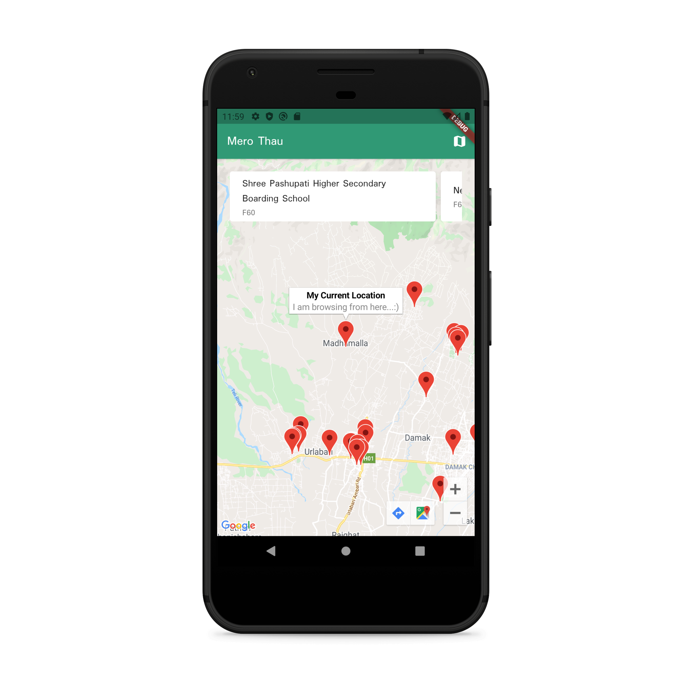
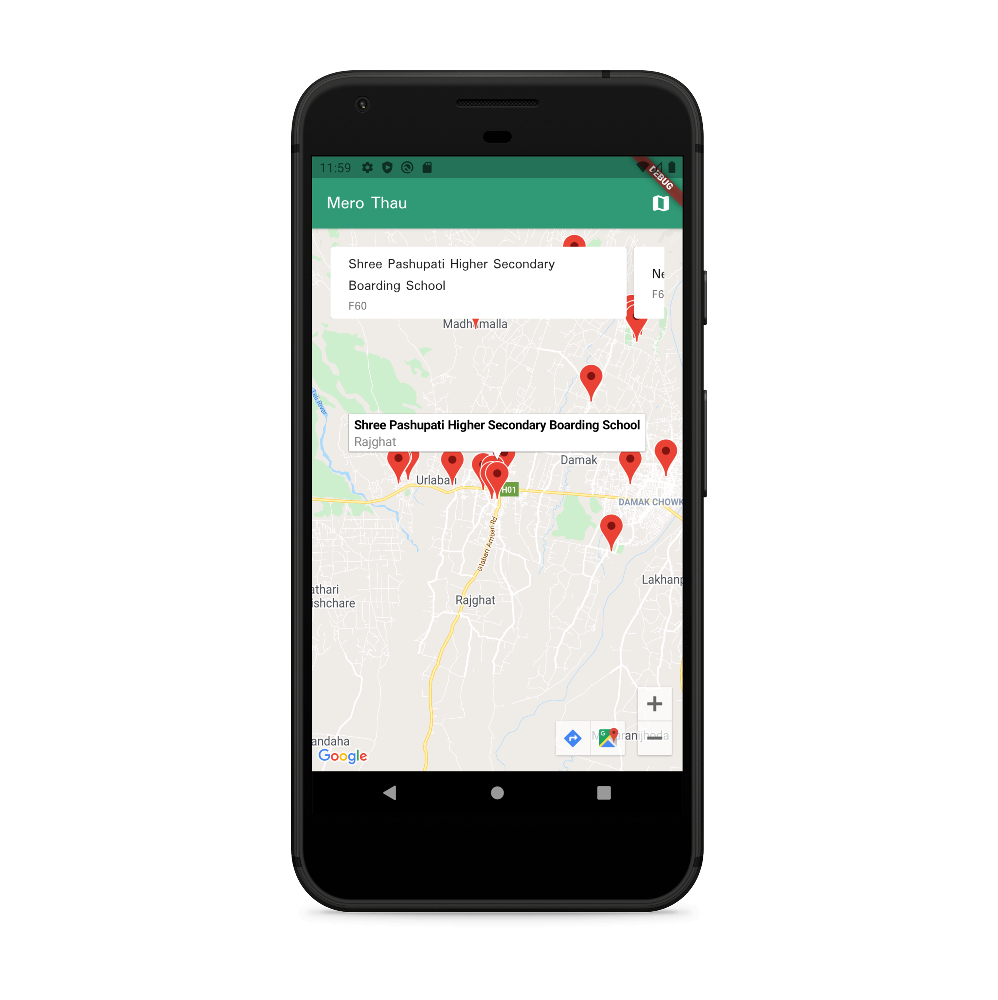
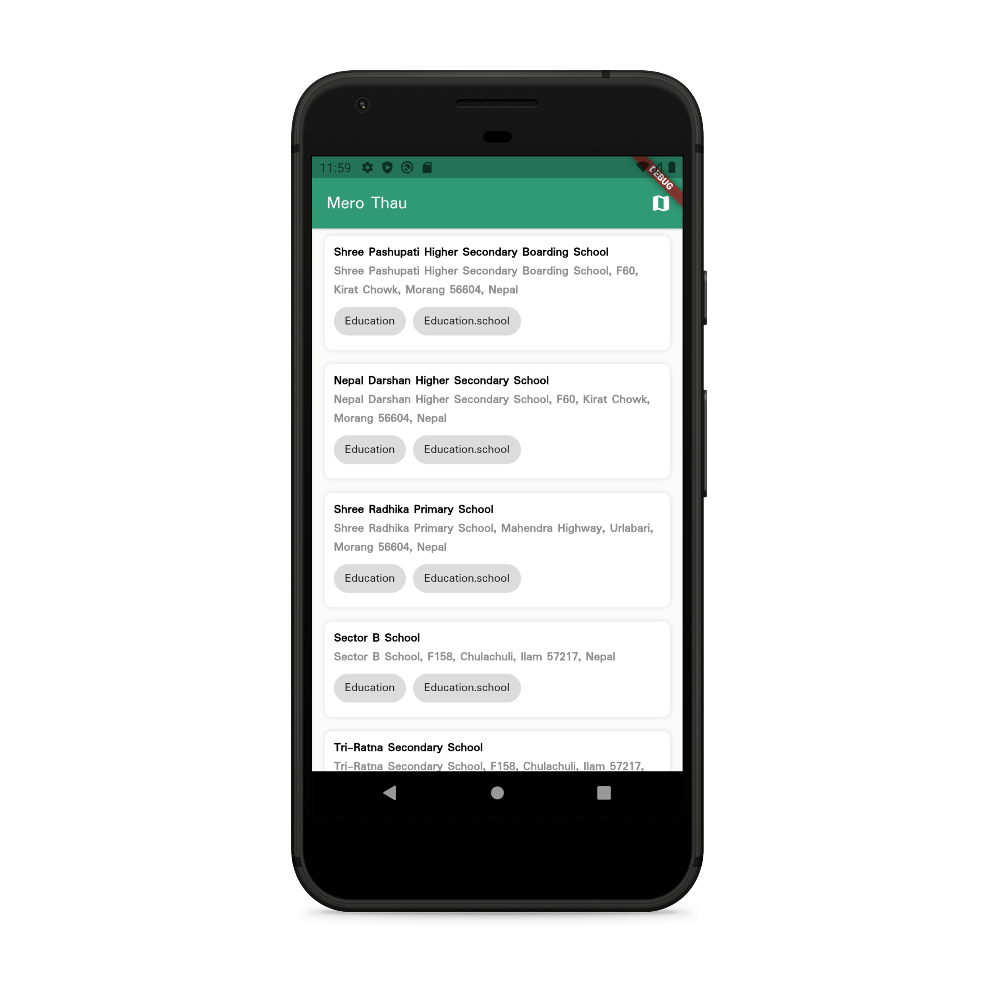

# google_map_in_flutter

Learn how to get the current location and integrate map to our flutter application.






Used packages:
- [json_serializable](https://pub.dev/packages/json_serializable)
For json deserialization

- [geolocator](https://pub.dev/packages/geolocator)
To get current user location
- [google_maps_flutter](https://pub.dev/packages/google_maps_flutter)
To Display map

- [http](https://pub.dev/packages/http)
to send network request nearby data

-[provider](https://pub.dev/packages/provider)


## Steps to run the program

* Set minSdk 
````code
android {
    defaultConfig {
        minSdkVersion 20
    }
}
````


* First create api key from google cloud console for map then replace in the AndroidManifest


```xml <manifest ...
  <application ...
    <meta-data android:name="com.google.android.geo.API_KEY"
               android:value="YOUR KEY HERE"/>
```

* Create api key from https://www.geoapify.com/ and replace in
api_keys.dart file

```dart
 factory ApiKeys.sandBox() {
    return ApiKeys(key: 'replace-your-keys-from-https://www.geoapify.com/');
  }
```

